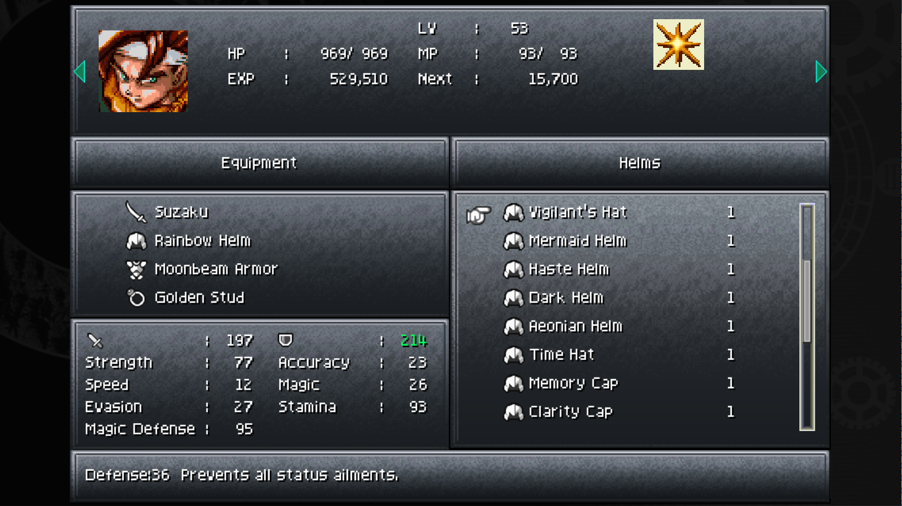
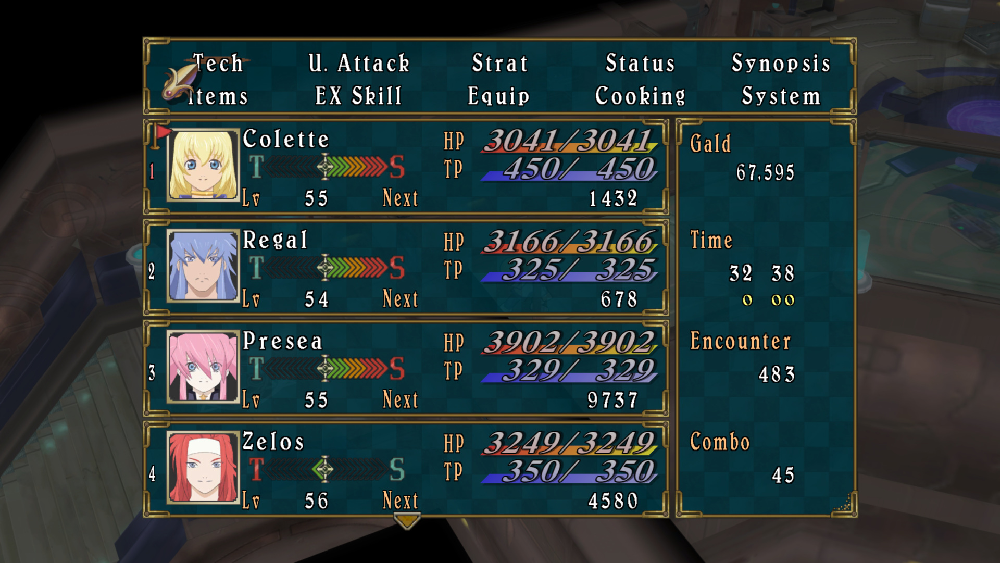
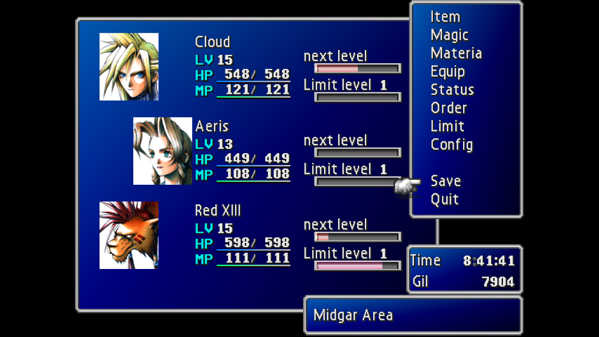

# Space-time(r)

It's a fairly simple, standalone, pomodoro timer, combined with some of my favorite music to focus to. Yes, I can accomplish the same thing with my phone clock and spotify, but for every timer alarm that goes off, or song that I want to skip, that's a brand new opportunity to get sidetracked checking a notification, or check a text message. 

Combining the two things into one tool helps remove unwanted distractions and minimize tangents.

## Functionality

There are two main functionalities for this project:

1. Timer with work duration, short break, and a long break.
2. Music functionality.

I had considered adding a task keeping feature, but as I was coding, I realized that the core of the site was; "How do I spend the least amount of time with my mouse in my hand". It's easier for me to jot down a task on a piece of scrap paper than it is to flip through a UI and add it to a list.

This isn't a means to replace a note taking app, it isn't a to-do list, it's essentially a screensaver or wallpaper meant to remind me that I should be working. 

## Asthetics
There's something I find really charming about old video game menu systems. Sections were clearly delineated, corners were sharp, and grids were laid out so as much info as possible was available at a glance.  

I started off wanting to paint a picture of sitting at the controls of a spaceship. Then I began to replay Tales of Symphonia and was reminded of playing Chrono Trigger, and I began to work on UI elements in Aseprite. 

It didn't take long before I scrapped the idea of creating the assets depicting a ship's console and decided that a game menu had all the clarity and simplicity I needed. I kept the idea of planets that moved in time with the timer's countdown. Like sand in an hourglass, it's nice to have a visual representation of the passage of time, but I needed something was wasn't going to grow distracting.

This was the compromise between my original concept of watching a journey through space, and my later pause menu idea. Yes, you can watch a planet creep by over the course of 1500 seconds if you really want, but ideally, you'd really only notice it once it's almost entirely off the screen. 

## Inspiration
#### Chrono Trigger

#### Tales of Symphonia

#### Final Fantasy 7

##